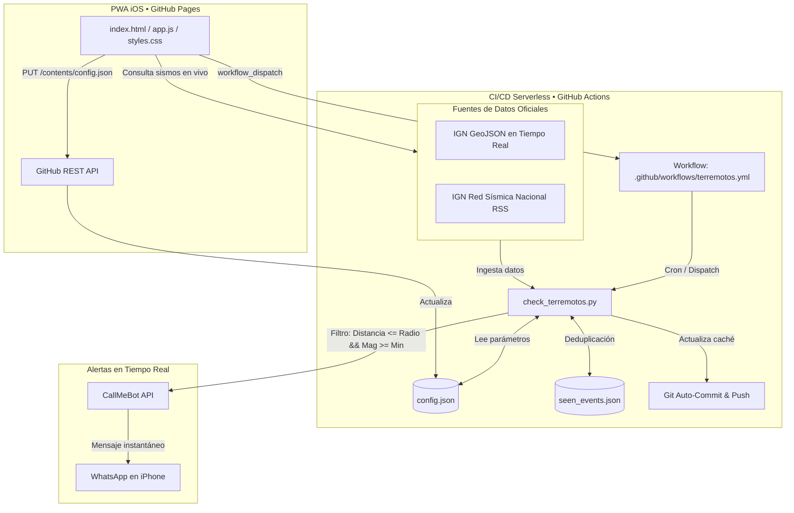

# 🌋 SismoGranada • Monitor Sísmico Serverless en Tiempo Real

> Sistema automatizado y serverless para la monitorización en tiempo real de terremotos en **Granada (España)** y sus alrededores con datos oficiales del **Instituto Geográfico Nacional (IGN)**, alertas inteligentes por **WhatsApp (CallMeBot)** y panel de control web móvil (**PWA estilo iOS**) desplegado en **GitHub Pages**.

---

## 🏗️ Arquitectura del Sistema



---

## 🚀 Características Principales

* 📍 **Cálculo Geodésico Exacto**: Distancias calculadas punto a punto con la fórmula de **Haversine** tomando como epicentro de referencia Granada capital (`37.1773, -3.5986`).
* 🔄 **Doble Fuente de Datos Resiliente**: Conexión primaria al feed de sismicidad reciente del IGN con fallback automático e instantáneo a la Red Sísmica Nacional (RSS XML) y respaldo sísmico europeo (EMSC).
* 📱 **Alertas Estructuradas por WhatsApp**: Mensajes enriquecidos con emojis, zona/municipio, magnitud `mbLg`, profundidad, distancia exacta en km y enlace oficial de la ficha técnica del IGN.
* 🧠 **Caché Inteligente Antiduplicados**: Registro de identificadores únicos en `seen_events.json` para no reenviar alertas de sismos ya procesados.
* 📲 **PWA Mobile-First Estilo iOS**: Interfaz visual inspirada en Cupertino (Human Interface Guidelines), con soporte para Modo Oscuro, mapa interactivo con Leaflet, sliders reactivos, soporte offline mediante Service Worker y botón "Añadir a pantalla de inicio".
* ☁️ **Sincronización Bidireccional con GitHub**: Edita `config.json` directamente desde tu iPhone realizando commits autenticados mediante la REST API de GitHub.
* ⚡ **Disparador Manual Instantáneo**: Botón *"Comprobar Sismos Ahora"* para ejecutar la GitHub Action al instante sin esperar al cron.

---

## 📋 Guía de Configuración Paso a Paso

Sigue estos 6 pasos para dejar el sistema funcionando al 100%:

### 1️⃣ Paso 1: Obtener la clave gratuita de CallMeBot (WhatsApp)

CallMeBot es un servicio gratuito que te permite recibir mensajes de WhatsApp a través de una API:

1. Guarda en la agenda de tu teléfono el contacto de CallMeBot: **`+34 941 83 13 86`** (o visita directamente [https://www.callmebot.com/blog/free-api-whatsapp-messages/](https://www.callmebot.com/blog/free-api-whatsapp-messages/)).
2. Abre WhatsApp y envía el siguiente mensaje exacto a dicho número:
   ```text
   I allow callmebot to send me messages
   ```
3. En pocos segundos recibirás una respuesta de CallMeBot con tu **API Key** personal:
   ```text
   CallMeBot API: Your APIKey is: 123456
   ```
4. Guarda tu **Número de Teléfono** (con prefijo internacional, ej. `34612345678`) y tu **API Key**.

---

### 2️⃣ Paso 2: Configurar los Secrets en tu Repositorio de GitHub

Para que GitHub Actions pueda enviar los mensajes de forma segura sin exponer tus datos privados:

1. Ve a tu repositorio en GitHub.
2. Entra en **Settings** > pestaña izquierda **Secrets and variables** > **Actions**.
3. Pulsa el botón verde **New repository secret** y añade los siguientes 2 secretos:

| Nombre del Secret | Descripción | Ejemplo de Valor |
| :--- | :--- | :--- |
| `PHONE_NUMBER` | Tu número de WhatsApp con código de país (sin el `+`) | `34612345678` |
| `CALLMEBOT_API_KEY` | La clave numérica que te envió el bot | `123456` |

---

### 3️⃣ Paso 3: Habilitar Permisos de Escritura para GitHub Actions

El workflow necesita permisos para guardar automáticamente la caché `seen_events.json`:

1. En tu repositorio, ve a **Settings** > **Actions** > **General**.
2. Desplázate hacia abajo hasta la sección **Workflow permissions**.
3. Selecciona: **✅ Read and write permissions**.
4. Marca la casilla **Allow GitHub Actions to create and approve pull requests** (opcional pero recomendado).
5. Pulsa **Save**.

---

### 4️⃣ Paso 4: Generar un Personal Access Token (PAT) de GitHub

Este token permite a la PWA en tu iPhone editar `config.json` y lanzar comprobaciones manuales:

1. En GitHub, haz clic en tu avatar (arriba a la derecha) > **Settings**.
2. Al final del menú izquierdo, haz clic en **Developer settings** > **Personal access tokens** > **Tokens (classic)**.
3. Haz clic en **Generate new token (classic)**.
4. Asígnale una nota descriptiva (ej. `SismoGranada PWA`).
5. Selecciona los siguientes permisos (**scopes**):
   * `repo` (Acceso completo a repositorios: permite leer y commitear en `config.json`).
   * `workflow` (Permite disparar workflows de GitHub Actions bajo demanda).
6. Haz clic en **Generate token** y copia el código generado (`ghp_xxxxxxxxxxxx`).

---

### 5️⃣ Paso 5: Activar GitHub Pages (Despliegue de la PWA)

Para tener la aplicación web disponible online en cualquier navegador y en tu iPhone:

1. En tu repositorio, ve a **Settings** > **Pages** (menú izquierdo).
2. En la sección **Build and deployment**:
   * **Source**: `Deploy from a branch`
   * **Branch**: selecciona `main` y la carpeta `/ (root)`
3. Pulsa **Save**.
4. En 1-2 minutos tu web estará publicada en:
   `https://<tu-usuario>.github.io/<tu-repositorio>/`

---

### 6️⃣ Paso 6: Configurar e Instalar la PWA en tu iPhone

1. Abre **Safari** en tu iPhone y entra en la URL de GitHub Pages de tu proyecto.
2. Pulsa el icono del engranaje **⚙️** (arriba a la derecha):
   * **Usuario:** Tu nombre de usuario en GitHub.
   * **Repositorio:** El nombre de este repositorio.
   * **Rama:** `main`
   * **Token (PAT):** El token `ghp_...` que creaste en el Paso 4.
   * Pulsa **Guardar Credenciales en Dispositivo** (se guardarán localmente en el almacenamiento seguro de Safari).
3. Para instalar la app como aplicación nativa:
   * Pulsa el botón **Compartir** de Safari (icono del cuadrado con flecha hacia arriba 📤).
   * Desplázate hacia abajo y selecciona **"Añadir a la pantalla de inicio"** (Add to Home Screen).
   * Pulsa **Añadir**.

¡Listo! Ya tienes el icono de **SismoGranada** en la pantalla de inicio de tu iPhone, con apertura instantánea a pantalla completa.

---

## ⏱️ Optimización de Créditos y Frecuencia de GitHub Actions

> [!TIP]
> ### 💡 ¿Repositorio Público o Privado?
> * **Repositorio PÚBLICO (Recomendado)**: En repositorios públicos de GitHub, **GitHub Actions es 100% GRATUITO e ILIMITADO**. No consume minutos de tu cuota mensual. Tus números y credenciales están totalmente protegidos en los GitHub Secrets.
> * **Repositorio PRIVADO**: Las cuentas gratuitas disponen de **2.000 minutos/mes**. Para optimizar tu cuota si tienes otros proyectos activos:

Puedes modificar la frecuencia del cron en `.github/workflows/terremotos.yml`:

```yaml
on:
  schedule:
    - cron: '*/15 * * * *'  # Ejecuta cada 15 minutos (óptimo para equilibrio cuota/tiempo real)
    # - cron: '*/5 * * * *'  # Ejecuta cada 5 minutos (usar si el repo es público)
    # - cron: '0 * * * *'    # Ejecuta cada 1 hora (máximo ahorro en repos privados)
```

Además, gracias al botón **"⚡ Comprobar Sismos Ahora"** en la PWA, puedes forzar una comprobación en cualquier momento bajo demanda sin esperar al temporizador.

---

## 📂 Estructura del Repositorio

```text
├── .github/
│   └── workflows/
│       └── terremotos.yml      # Workflow de GitHub Actions (Cron + Dispatch + Commit)
├── icons/
│   ├── icon.svg                # Icono vectorial escalable de la PWA
│   ├── icon-192.png            # Icono PNG resolución 192x192 para Android/PWA
│   └── icon-512.png            # Icono PNG resolución 512x512 para iOS Retina
├── check_terremotos.py         # Motor de monitorización en Python (Haversine + IGN + WhatsApp)
├── config.json                 # Parámetros dinámicos (radio_km, magnitud_min, notificar_whatsapp)
├── seen_events.json            # Caché de eventos procesados para evitar alertas duplicadas
├── index.html                  # Interfaz SPA Mobile-First estilo iOS
├── styles.css                  # Hoja de estilos con diseño Glassmorphism y Cupertino HIG
├── app.js                      # Lógica cliente, Leaflet map y conexión GitHub REST API
├── manifest.json               # Web App Manifest para instalación PWA
├── sw.js                       # Service Worker para caché offline
└── README.md                   # Documentación técnica completa
```

---

## 🛠️ Pruebas Locales en tu Ordenador

Si deseas ejecutar el monitor en tu entorno local:

```bash
# Definir variables de entorno de prueba
export PHONE_NUMBER="34612345678"
export CALLMEBOT_API_KEY="123456"

# En Windows PowerShell:
# $env:PHONE_NUMBER="34612345678"
# $env:CALLMEBOT_API_KEY="123456"

# Ejecutar el script
python check_terremotos.py
```

Para probar la PWA localmente en tu navegador:
```bash
python -m http.server 8000
# Abre http://localhost:8000 en tu navegador
```

---

## 📜 Licencia y Fuentes de Datos

* **Datos Sísmicos:** Información oficial proporcionada por el [Instituto Geográfico Nacional (IGN) de España](https://www.ign.es) bajo las condiciones de Reutilización de Información del Sector Público (RISP).
* **Licencia del Código:** MIT. Desarrollado con ❤️ para la comunidad de Granada y apasionados de la sismología.
